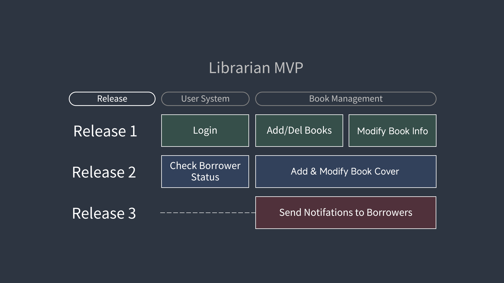

# ViTAL-Library-Management-System
ViTAL LMS | XDU Angaj Class

## Backend

### Architecture

PostgreSQL + Python Flask

### Database Data Backend

实现Flask后端+SQL数据库，实现查表、筛选等MySQL功能

### Database Logic Backend

实现Flask后端与前端的通信功能，比如用户登录后的处理

---

## Frontend

> Tech Stack: **[Vue3](https://www.runoob.com/vue3/vue3-tutorial.html) [HTML](https://www.runoob.com/html/html-tutorial.html) [CSS](https://www.runoob.com/css/css-tutorial.html) [JavaScript](https://www.runoob.com/js/js-tutorial.html)**

**注意如果不喜欢看视频的方式可以点击上面的四个技术栈标签，然后在打开的runoob的文本教程里面看**

考虑到可能有些人没有学过/写过Vue，这里放相关的学习链接在下面：

[Vue.js 3 官方中文文档](https://cn.vuejs.org/guide/introduction.html)

[Vue.js 3 中文官网](https://cn.vuejs.org)

[3小时学会 Vue.js 3](https://www.bilibili.com/video/BV1nV411Q7RX)

注意用的是Vue 3而不是Vue 2

然后是JavaScript的：

[四十分钟JavaScript快速入门 | 无废话且清晰流畅 | 手敲键盘 | WEB前端必备程序语言~](https://www.bilibili.com/video/BV15L4y1a7or)

HTML：

[二十分钟HTML快速入门 | 无废话且清晰流畅 | 手敲键盘 | WEB前端必备语言~](https://www.bilibili.com/video/BV1jf4y1J7Ms)

CSS：

[十七分钟CSS快速入门 | 无废话且清晰流畅 | WEB前端必备程序语言~](https://www.bilibili.com/video/BV1Ci4y1W7H7/?share_source=copy_web&vd_source=fa107d698b8fe27394c408229e71ed06)

以上**三个视频**加起来还不到**一个半小时**，比AJ一节课都短，相信**还没放弃就可以学完**。

然后JavaScript的快速入门教程可能教的内容不够，不过边学边做应该能解决

然后在Vue中，有个新东西（我不确定以前的有没有）叫做路由，用来进入不同页面的（其实就是进入不同的Vue文件），以下也有个课程：

[【2024新版】20分钟学会Vue Router4(路由)，Vue3视频教程，web前端快速入门实战课程](https://www.bilibili.com/video/BV1xt421h7LC/?share_source=copy_web&vd_source=fa107d698b8fe27394c408229e71ed06)

### Library Page UI

#### 1. Client Part

+ Main Page 主页
+ Search Page 搜索页
+ Detailed Page 图书详细页
+ Notification Page 通知页
+ Borrow&Return Page 借阅-归还页

#### 2. Client Login Part

+ Personal Information Page 个人信息页
+ Personal Information Change Page 个人信息更改页
+ Login Page 登录页
+ Register Page 注册页
+ Forget Password Page 忘记密码页

#### 3. Librarian Part

+ Background Mainpage 后台主页
+ Book Information Editing Page 图书信息编辑页
+ Borrowed Books Information Page 已借阅图书查找/信息页
+ Notification Sending Page 通知发送页

## MVP

")

Normal User(Client) MVP

Libranrian MVP

